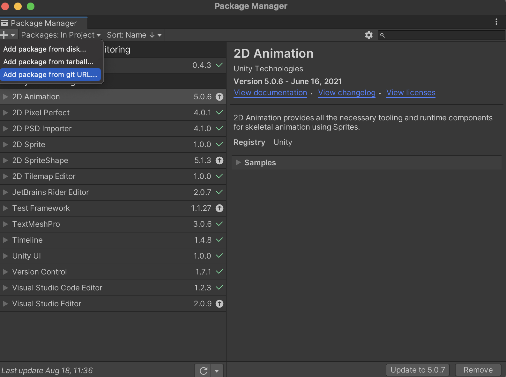
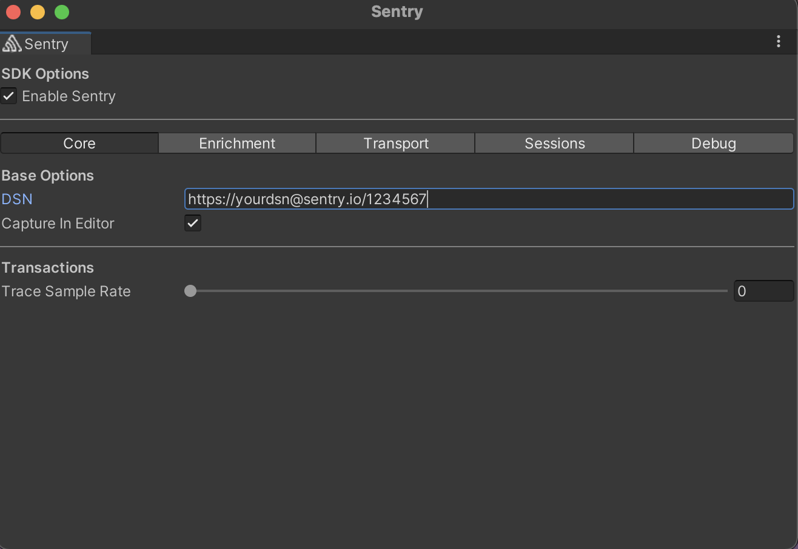
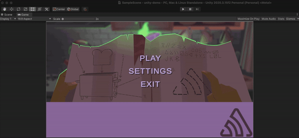

## Overviews

This project is a demo implementation of **sentry-unity**, the Sentry SDK for Unity Crash Reporting. The demo produces several crashes that get captured by sentry-unity and sent to Sentry.io. You can also download the SDK manually here https://github.com/getsentry/sentry-unity as a distribution zip.

The **Official Sentry Documentation** for Unity is at https://docs.sentry.io/platforms/unity/

## Setup
| dependency    |    version     |
| ------------- | :------------: |
| sentry-unity  |     0.4.3      |
| unity hub     |     2.4.5      |
| unity version |   2020.3.15f2  |
| macOS         |  Big Sur 11.4  |

### Unity

Download Unity Hub using this link https://unity3d.com/get-unity/download 

You'll be prompoted to create an account if you want the free version.

## Configuration 

For this demo Sentry is installed but you can easily install Sentry package from Unity's package manager using this git url: https://docs.sentry.io/platforms/unity/

You can now access Sentry's Configuration Window under *Unity->Tools->Sentry*

### DSN key

Sentry can be configured via the Sentry configruation window or [programatically](https://docs.sentry.io/platforms/unity/configuration/options/). 

## Run
1. clone this repo 
2. Go to Unity Hub, Add this repo as a project
3. Install proper vesion of unity if need be  
4. Click the run button 

## Expected Behavior 

Welcome to Senty's unity game!

**Play** -> C# throw/try/catch and `Debug.LogError`

**Settings** -> Navigates to Settings Menu

**Exit** -> C# throw null- undhandled by user code
 

## GIF

